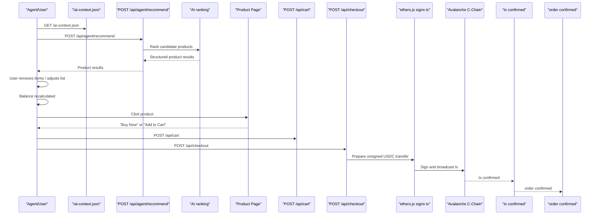

# AISLE Architecture

## Sequence Diagram

## Data Flow Narrative

AISLE starts from a prompt-first shopper flow and an agent-first discovery flow. Human shoppers interact with the React app, while agents can discover the store through `/ai-context.json` and then call structured endpoints directly.

On the server, Express exposes product, agent, cart, checkout, and order APIs. Product search first queries the catalogue, then the agent services optionally use OpenAI to rank candidates or extract ingredient lists. When OpenAI is unavailable or malformed, AISLE falls back to deterministic catalogue behavior.

Cart items store price snapshots so checkout never re-prices against live catalogue data. The checkout API prepares an unsigned USDC transfer, the client signs it with `ethers`, and the backend finalizes against the returned transaction hash. Orders are stored as `confirmed`, `pending`, or `failed`.

For local demo resilience, the repository layer falls back to in-memory demo data if PostgreSQL is unavailable. That keeps the live demo path working on machines without a running database, while preserving the Prisma/PostgreSQL implementation path for full environments.

## Decision Log

### Why Avalanche

Avalanche C-Chain gives AISLE an EVM-compatible payment rail with mature wallet tooling, straightforward ERC-20 transfer handling, and an obvious stablecoin checkout story for hackathon judging. Fuji is a practical demo target while keeping the production shape aligned with C-Chain.

### Why Anonymous Sessions

AISLE is explicitly trying to remove friction for both people and agents. Anonymous UUID-backed carts avoid login walls, cookies-as-identity, and account setup steps that break autonomous shopping flows.

### Why Price Snapshots

Checkout uses cart snapshots so total calculations are stable and auditable. That prevents catalogue drift from mutating the amount between add-to-cart and payment.

### Why CORS-Open Agent Endpoints

The store is designed for agents as first-class users. CORS-open, no-auth endpoints let external AI agents interact programmatically without browser scraping or brittle session bootstrapping.

### Why Two AI Endpoints

Single-product ranking and grocery-list generation are materially different tasks. Splitting them keeps payloads simpler, makes acceptance criteria easier to test, and lets fallback logic stay clear.

### Why Slide-Up Checkout Modal

The checkout modal preserves context. Shoppers can review results or product details, enter payment, and complete a purchase without a route-level interruption. It also gives `Buy Now` a shared surface from both cards and product pages.
